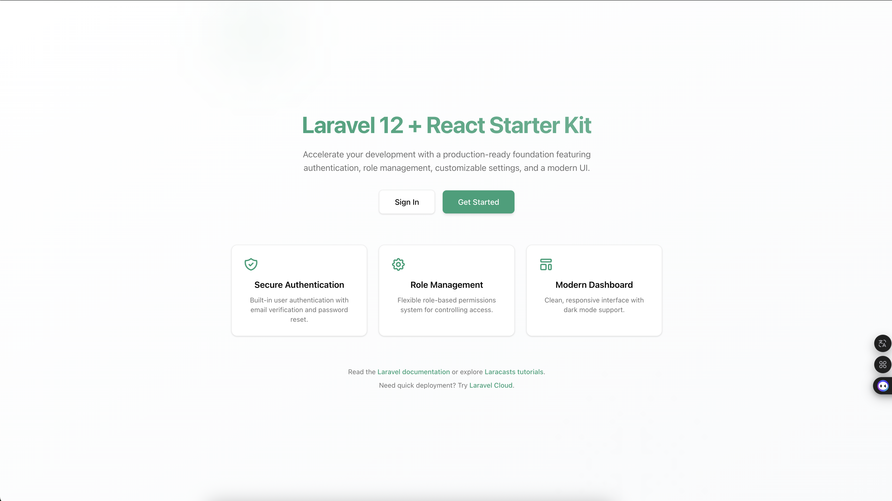

# 🚀 Laravel 12 + React Starter Kit

A modern and flexible starter kit built with **Laravel 12**, **React (Inertia.js + TypeScript)**, **TailwindCSS**, and **ShadCN UI v4**. Designed to accelerate secure, responsive, and customizable dashboard application development.

---

## ✨ Features

- 🔐 Full authentication (login, register, reset password)
- 👥 Role & Permission Management (Spatie Laravel Permission)
- 📂 Dynamic Sidebar & Menus based on role & permission
- 🧩 Drag & drop menu management (nested, reorder)
- ⚙️ App settings (name, logo, theme color, SEO)
- 🎨 ShadCN UI v4 + TailwindCSS modern design
- 🌗 Dark/Light mode support
- 🔒 Dynamic access protection via `CheckMenuPermission` middleware
- ⚠️ Custom 403 Error Page (React-based)
- 💾 Primary color configuration via DB `--primary`
- 🪪 Audit Log to track user activity
- 📦 Manual & automatic database backup system
- 🗂️ File Manager with folder & file operations

---

## 🧱 Tech Stack

| Area        | Technology                         |
| ----------- | ---------------------------------- |
| Backend     | Laravel 12                         |
| Frontend    | React 19 + Inertia.js + TypeScript |
| UI Library  | ShadCN UI v4                       |
| CSS Utility | TailwindCSS                        |
| Auth        | Laravel Fortify / Breeze-style     |
| Access Ctrl | Spatie Laravel Permission v5       |
| DBMS        | MySQL / MariaDB                    |
| Layout      | Dynamic Sidebar + Header           |

---

## 🔧 Installation & Setup

```bash
# Clone the repository
git clone https://github.com/yogijowo/laravel12-react-starterkit.git
cd laravel12-react-starterkit

# Backend setup
composer install
cp .env.example .env
php artisan key:generate
php artisan migrate:fresh --seed

# Frontend setup
npm install

# Running dev
composer run dev
```

Login using:

```
Email: admin@admin.com
Password: admin123
```

---

## 🚀 Deployment Guide

1. **Build Frontend for Production**

```bash
npm install
npm run build
```

2. **Run Laravel in Production Mode**

```bash
php artisan config:cache
php artisan route:cache
php artisan view:cache
```

3. **Set File Permissions**

```bash
chmod -R 775 storage bootstrap/cache
chown -R www-data:www-data .
```

4. **Serve with Web Server** (Nginx/Apache) pointing to `public/` folder.

---

## 🖼️ Application Screenshots

### 📌 Dashboard (light)

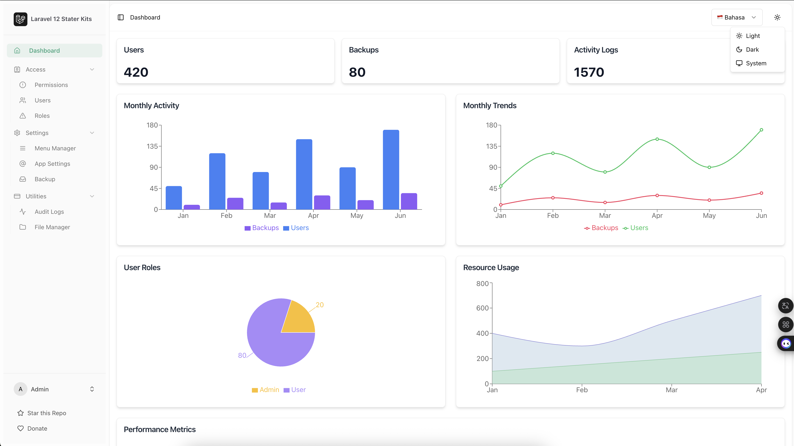

### 📌 Dashboard (dark)

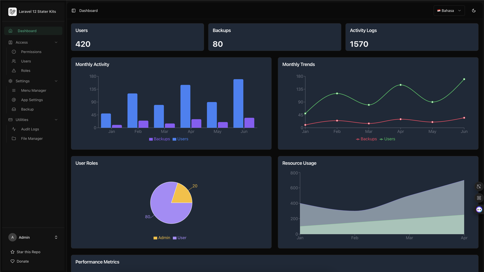

### 📌 User Management

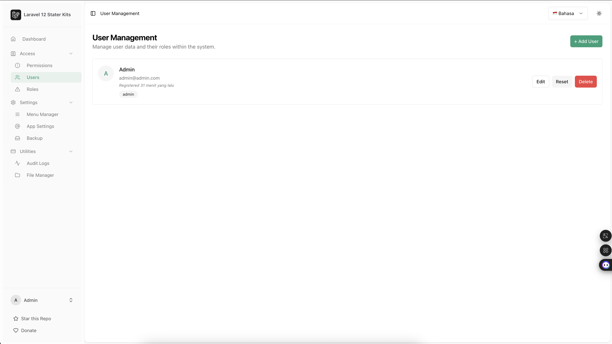

### 📌 Role Management

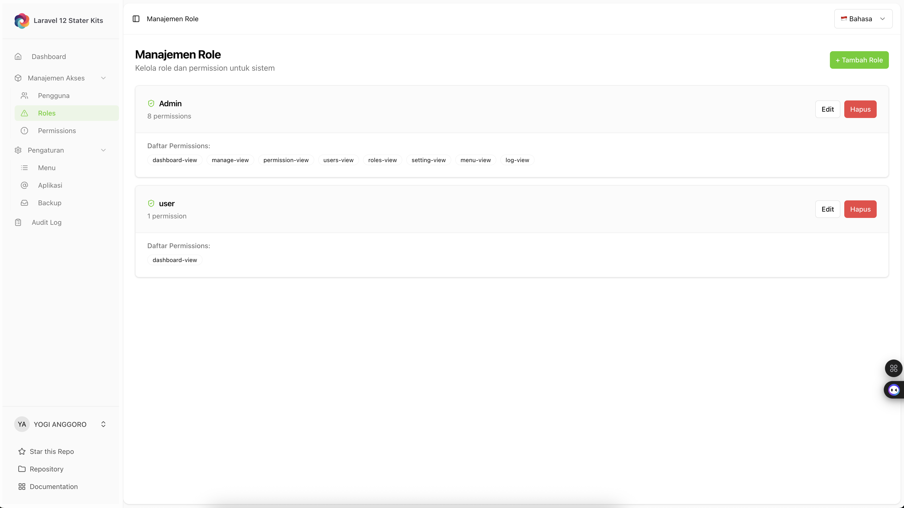

### 📌 Permission Management

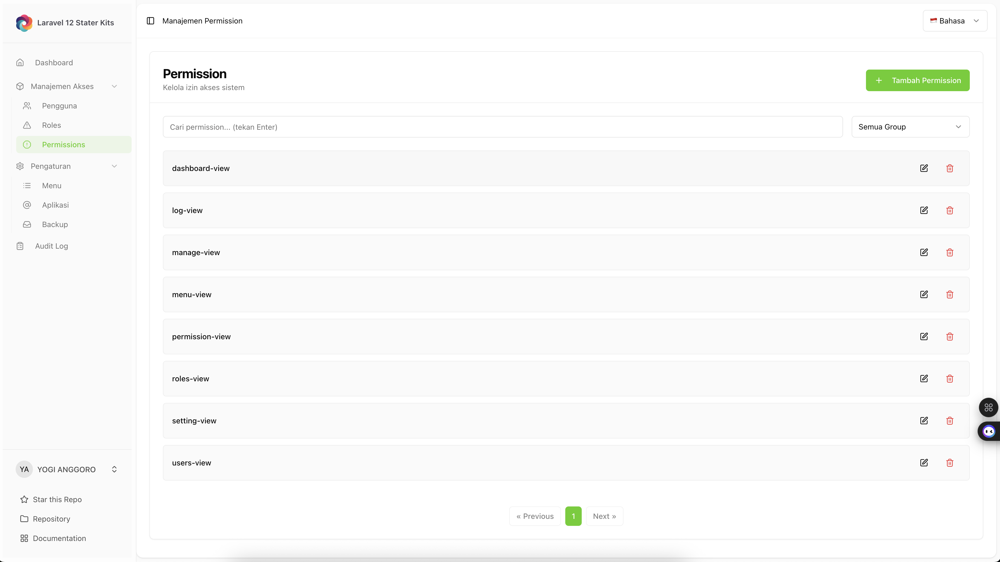

### 📌 Menu Manager

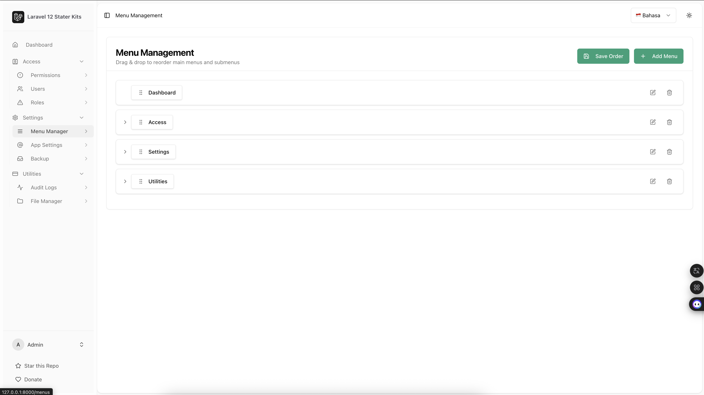

### 📌 App Settings

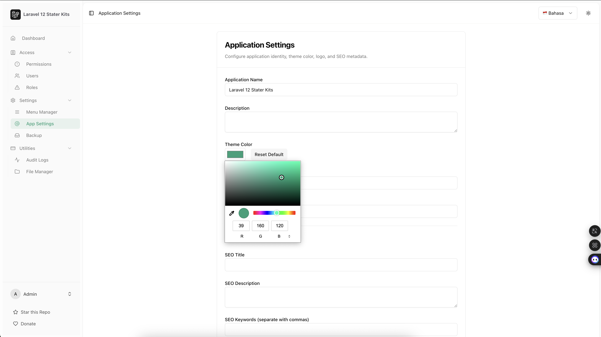

### 📌 Audit Logs

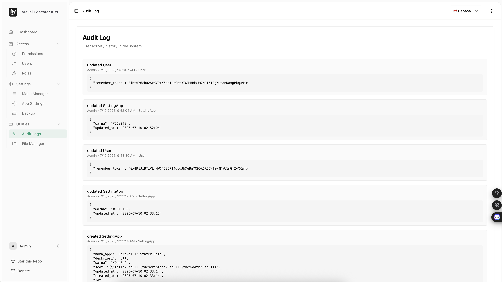

### 📌 Database Backup

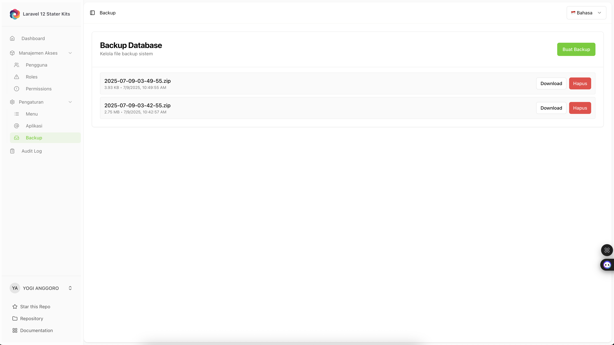

### 📌 File Manager

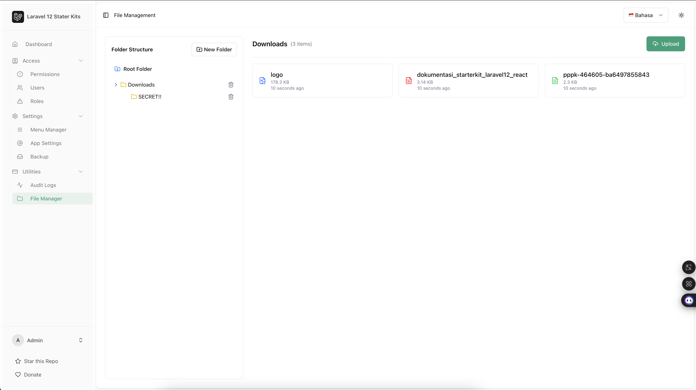

---

## ✅ Manual Test Checklist

| Feature                  | Status |
| ------------------------ | ------ |
| Authentication (Login)   | ✅     |
| CRUD User                | ✅     |
| CRUD Role & Permission   | ✅     |
| Dynamic Menu + Sidebar   | ✅     |
| Access Protection (403)  | ✅     |
| Drag & Drop Menu Sorting | ✅     |
| Theme Color via DB       | ✅     |
| Dark Mode Support        | ✅     |
| Audit Logs Functionality | ✅     |
| Database Backup          | ✅     |
| File Manager             | ✅     |

---

## ☕ Support This Project

If you find this starter kit helpful, consider supporting me:

- 💖 [Donate via Ko-fi](https://ko-fi.com/yogijowo)
- 🧧 [Donate via Saweria](https://saweria.co/yogijowo)
- 🙌 Share this repo with others

Your support helps me keep improving this open-source project. Thank you! 🙏

---

## 📄 License

Released under the [MIT License](https://opensource.org/licenses/MIT). Feel free to use it for personal or commercial projects.

---

## 🇵🇸 Free Palestine

> **"You don’t have to be Palestinian to stand for Palestine. You just have to be human."**

We stand with the people of Palestine. We reject colonialism, injustice, and violence.
**Freedom is a human right. FREE PALESTINE 🇵🇸**

---

Created with ❤️ by [@yogijowo](https://github.com/yogijowo)
