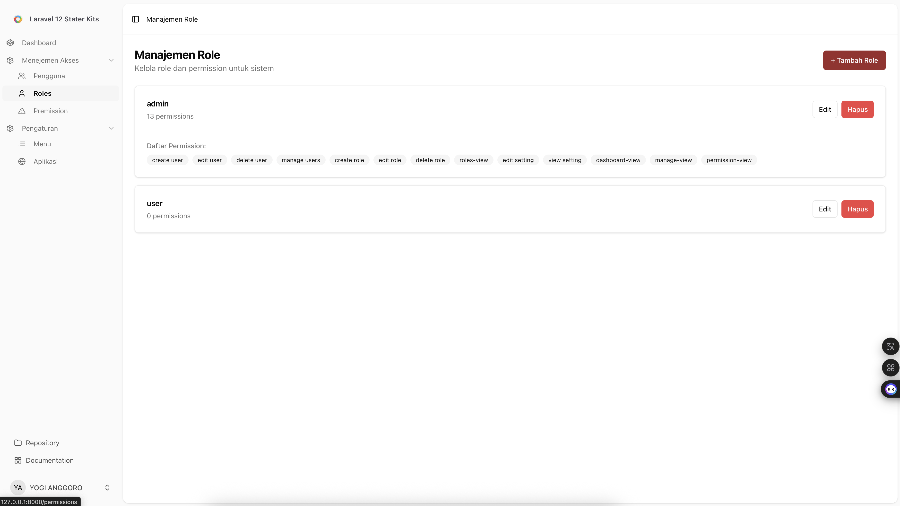

# 🚀 Laravel 12 + React Starter Kit

Starter kit modern dan fleksibel berbasis **Laravel 12**, **React (Inertia.js + TypeScript)**, **TailwindCSS**, dan **ShadCN UI v4**. Dirancang untuk mempercepat pengembangan aplikasi dashboard yang aman, responsif, dan mudah dikustomisasi — dari manajemen user hingga pengaturan aplikasi dinamis.

---

## ✨ Fitur Utama

- 🔐 Autentikasi lengkap (login, register, reset password)
- 👥 Manajemen Role & Permission (Spatie Laravel Permission)
- 📂 Sidebar & Menu Dinamis berdasarkan role & permission
- 🧩 Drag & drop manajemen menu (nested, reorder)
- ⚙️ Pengaturan aplikasi (nama, logo, warna utama, SEO)
- 🎨 UI modern dengan ShadCN UI v4 + TailwindCSS
- 🌗 Dukungan dark/light mode
- 🔒 Proteksi akses dinamis via middleware
- ⚠️ Halaman 403 custom (React-based)
- 💾 Setting warna `--primary` langsung dari database

---

## 🧱 Stack Teknologi

| Area        | Teknologi                          |
| ----------- | ---------------------------------- |
| Backend     | Laravel 12                         |
| Frontend    | React 19 + Inertia.js + TypeScript |
| UI Komponen | ShadCN UI v4                       |
| CSS Utility | TailwindCSS                        |
| Autentikasi | Laravel Fortify / Breeze-style     |
| Hak Akses   | Spatie Laravel Permission (v5)     |
| DBMS        | MySQL / MariaDB                    |
| Layout      | Sidebar + Header dinamis           |

---

## 📁 Struktur Fitur

### 🔐 Autentikasi

- Halaman login, register, reset password
- Layout responsif (card / split / minimal)
- Session management (logout, flash, redirect)

### 👤 Manajemen User

- CRUD User
- Assign Role ke User

### 🧩 Manajemen Role & Permission

- CRUD Role
- CRUD Permission
- Assign permission ke role
- Assign role ke user
- Terintegrasi dengan `Spatie\Permission\Traits\HasRoles`

### 📂 Menu Dinamis

- Tabel `menus`: `id`, `title`, `icon`, `route`, `parent_id`, `order`, `permission_name`
- Nested submenu (multi-level)
- Sidebar hanya menampilkan menu yang diizinkan oleh permission user
- Fitur drag-and-drop menggunakan `@dnd-kit/core`
- Penyimpanan urutan + struktur nested ke DB

### ⚙️ Pengaturan Aplikasi

- Tabel `settingapp`: `nama_app`, `logo`, `favicon`, `warna`, `seo_meta`
- Disimpan dan dibaca melalui layout
- Variabel warna (`--primary`) langsung di-set dari DB tanpa rebuild Tailwind

### 🚫 Proteksi Akses

- Middleware `CheckMenuPermission`: mengecek `request->route()` terhadap `menus.permission_name`
- User akan diarahkan ke halaman `403` jika tidak memiliki izin

### ⚠️ Halaman Error React

- `resources/js/pages/errors/403.tsx`
- Menggunakan ShadCN UI: tombol, ikon, dan layout konsisten
- Layout bisa dikustom (AppLayout / AuthLayout / ErrorLayout)

---

## 🖼️ Tampilan Aplikasi

### 📌 Manajemen Role



### 📌 Manajemen Menu


### 📌 Pengaturan Aplikasi


---

## 🛠️ Instalasi Cepat

```bash
git clone https://github.com/yogijowo/laravel12-react-starterkit.git
cd laravel12-react-starterkit

cp .env.example .env
composer install
php artisan key:generate
php artisan migrate

npm install
npm run dev
```

---

## 🗂️ Struktur Folder Frontend

```
resources/js/
├── components/        # Komponen UI (ShadCN & custom)
├── hooks/             # React custom hooks
├── layouts/           # AppLayout, AuthLayout, ErrorLayout
├── lib/               # Icon mapper, utilitas lainnya
├── pages/             # Halaman (Inertia)
│   ├── dashboard/     # Contoh halaman dashboard
│   └── errors/403.tsx # Halaman error custom
├── types/             # TypeScript interfaces & types
└── ...
```

---

## 🧪 Testing Manual

| Fitur                            | Status |
| -------------------------------- | ------ |
| Login / Logout                   | ✅     |
| CRUD Role & Permission           | ✅     |
| Sidebar dinamis per permission   | ✅     |
| Proteksi halaman otomatis (403)  | ✅     |
| Drag & drop menu & simpan urutan | ✅     |
| Dark mode & warna tema dinamis   | ✅     |
| Halaman error 403 dengan React   | ✅     |

---

## 📄 Lisensi

Starter kit ini dirilis dengan lisensi [MIT License](https://opensource.org/licenses/MIT).
Silakan gunakan untuk proyek pribadi maupun komersial.

---

## 🇵🇸 Free Palestine

> **“You don’t have to be Palestinian to stand for Palestine. You just have to be human.”**

Kami berdiri bersama rakyat Palestina.
Kami menolak penjajahan, kekerasan, dan ketidakadilan.
**Freedom is a human right. FREE PALESTINE 🇵🇸**

---

---

## ☕ Dukung Saya

Jika starter kit ini membantu Anda, silakan dukung saya dengan memberikan donasi melalui [Saweria](https://saweria.co/yogijowo).
Setiap dukungan Anda sangat berarti! Terima kasih!

Dibuat dengan ❤️ oleh [@yogijowo](https://github.com/yogijowo)
