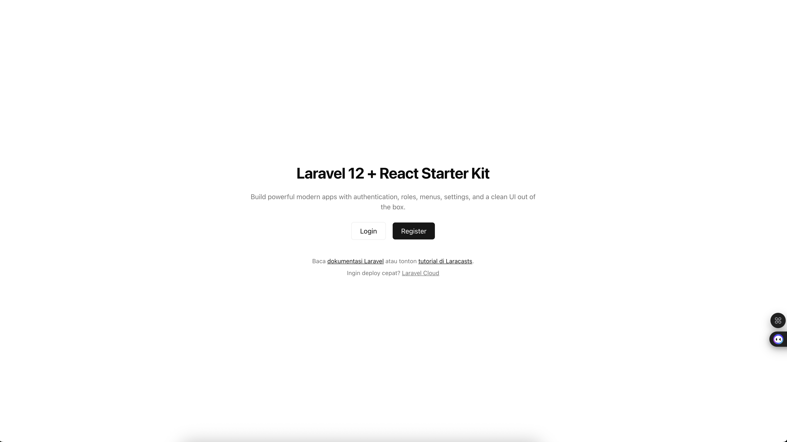
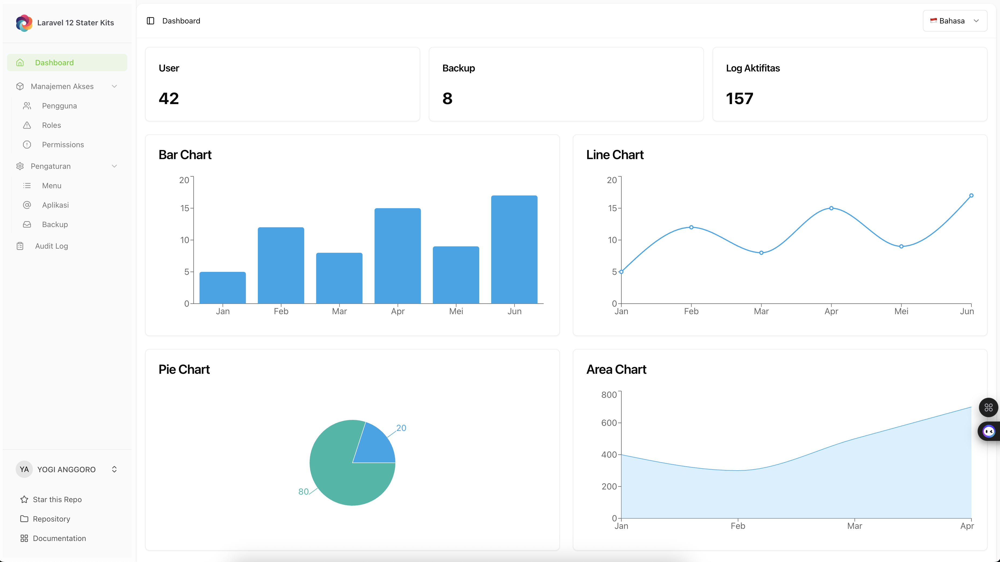
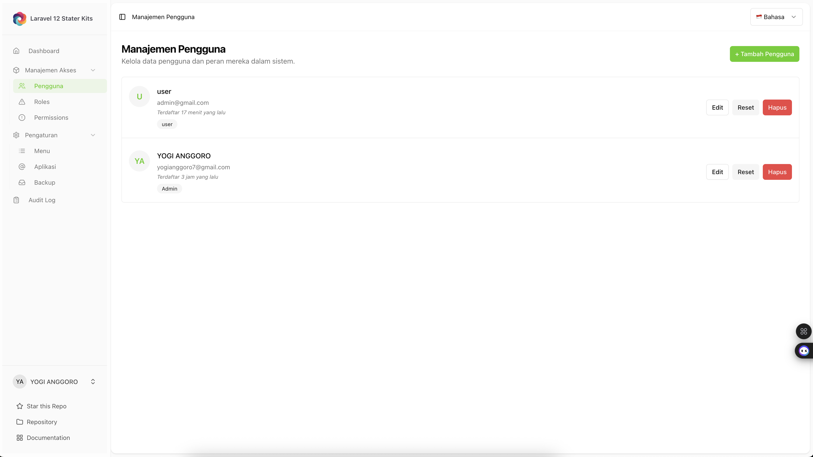
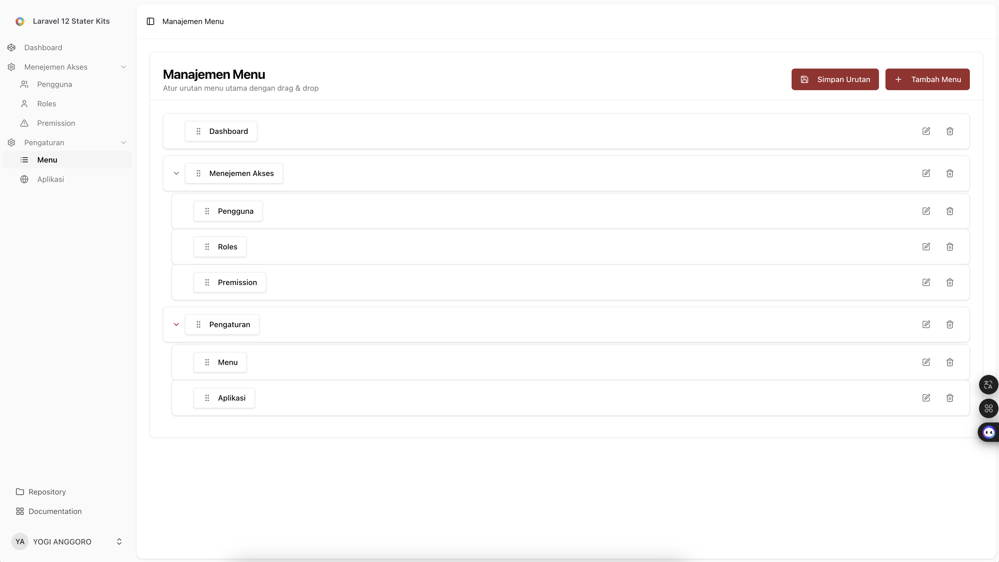
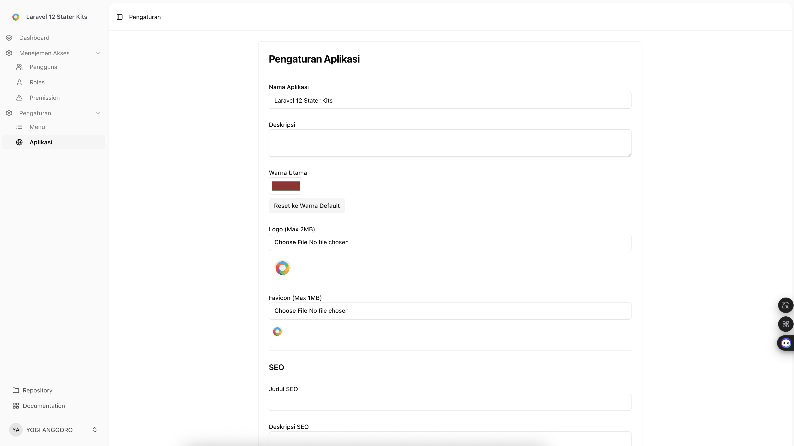
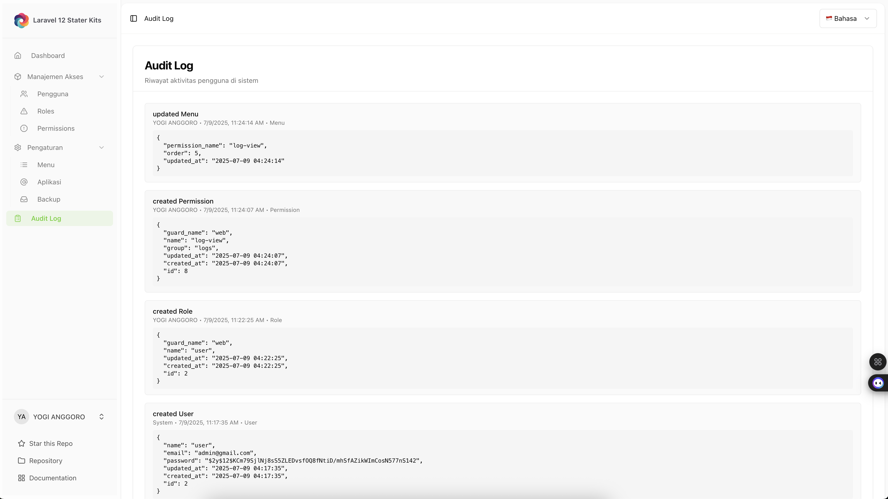

# 🚀 Laravel 12 + React Starter Kit



Starter kit modern dan fleksibel berbasis **Laravel 12**, **React (Inertia.js + TypeScript)**, **TailwindCSS**, dan **ShadCN UI v4**. Dirancang untuk mempercepat pengembangan aplikasi dashboard yang aman, responsif, dan mudah dikustomisasi.

---

## ✨ Fitur Utama

- 🔐 Autentikasi lengkap (login, register, reset password)
- 👥 Manajemen Role & Permission (Spatie Laravel Permission)
- 📂 Sidebar & Menu Dinamis berdasarkan role & permission
- 🧩 Drag & drop manajemen menu (nested, reorder)
- ⚙️ Pengaturan aplikasi (nama, logo, warna utama, SEO)
- 🎨 UI modern dengan ShadCN UI v4 + TailwindCSS
- 🌗 Dukungan dark/light mode
- 🔒 Proteksi akses dinamis via middleware `CheckMenuPermission`
- ⚠️ Halaman error 403 React-based
- 💾 Setting warna `--primary` langsung dari database
- 🪪 Audit Log untuk pelacakan aktivitas pengguna
- 📦 Fitur Backup Database otomatis/manual

---

## 🧱 Stack Teknologi

| Area        | Teknologi                          |
| ----------- | ---------------------------------- |
| Backend     | Laravel 12                         |
| Frontend    | React 19 + Inertia.js + TypeScript |
| UI Komponen | ShadCN UI v4                       |
| CSS Utility | TailwindCSS                        |
| Autentikasi | Laravel Fortify / Breeze-style     |
| Hak Akses   | Spatie Laravel Permission v5       |
| DBMS        | MySQL / MariaDB                    |
| Layout      | Sidebar + Header dinamis           |

---

## 📁 Struktur Fitur

### 🔐 Autentikasi

- Halaman login, register, reset password
- Layout responsif (card / split / minimal)
- Session management (logout, flash, redirect)

### 👤 Manajemen Pengguna

- CRUD User
- Assign Role ke User

### 🧩 Manajemen Role & Permission

- CRUD Role
- CRUD Permission
- Assign Permission ke Role
- Assign Role ke User
- Integrasi penuh dengan `Spatie\Permission\Traits\HasRoles`

### 📂 Menu Dinamis

- Tabel `menus`: `id`, `title`, `icon`, `route`, `parent_id`, `order`, `permission_name`
- Nested submenu (multi-level)
- Sidebar hanya menampilkan menu berdasarkan permission user
- Drag & drop reorder (DnD Kit)
- Simpan struktur ke DB secara dinamis

### ⚙️ Pengaturan Aplikasi

- Tabel `settingapp`: `nama_app`, `logo`, `favicon`, `warna`, `seo_meta`
- UI untuk update pengaturan
- Warna utama dikontrol lewat variable CSS `--primary`
- Logo dan favicon ditampilkan otomatis

### 🪪 Audit Log

- Menyimpan aktivitas pengguna (create, update, delete)
- Dicatat: user, waktu, jenis aksi, data sebelumnya/sekarang
- Ditampilkan dalam tampilan JSON viewer

### 💾 Backup

- Buat dan download file backup DB
- Fitur backup manual dengan timestamp
- Tombol "Download" dan "Hapus" untuk setiap backup

---

## 🖼️ Tampilan Aplikasi (Screenshots)

### 📌 Halaman Dashboard



### 📌 Manajemen Pengguna



### 📌 Manajemen Role


### 📌 Manajemen Permission


### 📌 Manajemen Menu



### 📌 Pengaturan Aplikasi



### 📌 Audit Log



### 📌 Backup Database


### 📌 Landing Page


---

## ⚙️ Instalasi & Setup

```bash
# Clone repo
https://github.com/yogijowo/laravel12-react-starterkit.git
cd laravel12-react-starterkit

# Install backend
composer install
cp .env.example .env
php artisan key:generate
php artisan migrate

# Install frontend
npm install

# Running
composer run dev
```

---

## 📂 Struktur Folder Frontend

```
resources/js/
├── components/        # Komponen UI (ShadCN & custom)
├── hooks/             # React custom hooks
├── layouts/           # Layout utama (App, Auth, Error)
├── lib/               # Utilitas dan ikon
├── pages/             # Halaman Inertia
│   ├── dashboard/     # Dashboard user
│   └── errors/403.tsx # Halaman akses ditolak
├── types/             # TypeScript type definition
```

---

## ✅ Checklist Uji Manual

| Fitur                      | Status |
| -------------------------- | ------ |
| Login / Logout             | ✅     |
| CRUD User                  | ✅     |
| CRUD Role & Permission     | ✅     |
| Menu & Sidebar dinamis     | ✅     |
| Proteksi akses & Error 403 | ✅     |
| Drag & drop menu           | ✅     |
| Theme warna dari DB        | ✅     |
| Dark mode                  | ✅     |
| Audit log aktif            | ✅     |
| Backup database            | ✅     |

---

## 📄 Lisensi

Starter kit ini dirilis dengan lisensi [MIT License](https://opensource.org/licenses/MIT). Bebas digunakan untuk proyek pribadi maupun komersial.

---

## 🇵🇸 Free Palestine

> **“You don’t have to be Palestinian to stand for Palestine. You just have to be human.”**

Kami berdiri bersama rakyat Palestina. Kami menolak penjajahan, kekerasan, dan ketidakadilan.
**Freedom is a human right. FREE PALESTINE 🇵🇸**

---

## ☕ Dukung Proyek Ini

Jika starter kit ini bermanfaat bagi Anda, silakan dukung saya di [Saweria](https://saweria.co/yogijowo).
Terima kasih atas dukungan Anda 🙏

---

Dibuat dengan ❤️ oleh [@yogijowo](https://github.com/yogijowo)
